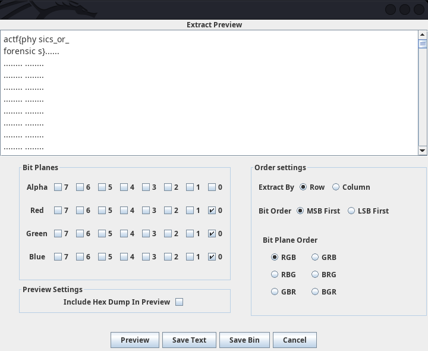

#### Challenge:

My physics teacher also loves puzzles. Maybe my [homework](./physics_hw.png ":ignore") is a puzzle too?

---

#### Solution:

After opening image in `stegsolve`, I noticed there is some noise in the top left corner in the `0-th bitplane` of each RGB color. Extracting the data from it reveals the flag:



---

<details><summary>FLAG:</summary>

```
actf{physics_or_forensics}
```

</details>
<br/>
