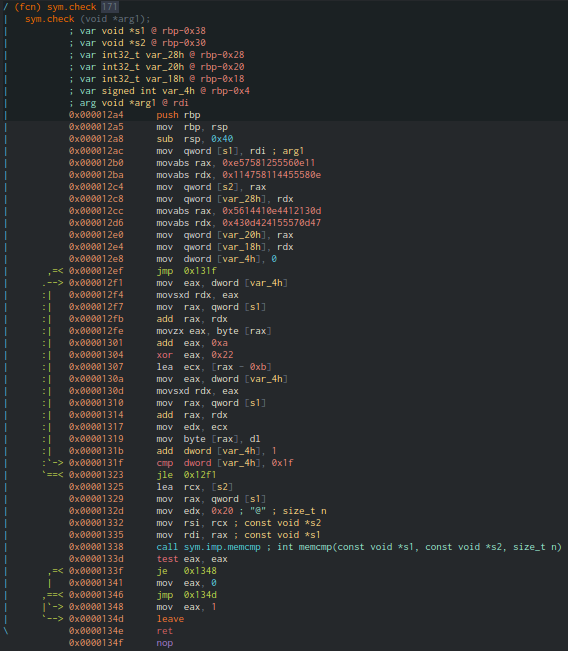

#### Challenge:

I wrote all this manually in 1000 and 1 night.
It seems that the solution will take the same amount of time.
After connecting to the server, it will ask you for a token for a binary.
You need to enter the correct tokens for the requested files and you will receive a flag. [files.tar.lzma](./files.tar.lzma ":ignore")

`nc tasks.aeroctf.com 44324`

---

#### Solution:

```bash
tar --lzma -xvf files.tar.lzma
```

- after inspecting few files, all of them share same check code with slightly different values

```c
ulong check(void *pvParm1)
{
  int iVar1;
  undefined8 local_38;
  undefined8 local_30;
  undefined8 local_28;
  undefined8 local_20;
  int local_c;

  local_38 = 0xe57581255560e11;     // secret part-1
  local_30 = 0x114758114455580e;    // secret part-2
  local_28 = 0x5614410e4412130d;    // secret part-3
  local_20 = 0x430d424155570d47;    // secret part-4
  local_c = 0;
  while (local_c < 0x20) {
    *(char *)((long)pvParm1 + (long)local_c) =
         (*(char *)((long)pvParm1 + (long)local_c) + 10U ^ 0x22) - 0xb; // secret args (10U, 0x22, 0xb)
    local_c = local_c + 1;
  }
  iVar1 = memcmp(pvParm1,&local_38,0x20);
  return (ulong)(iVar1 == 0);
}
```

- these values can be easily retrieved via disassembling `check` function



```python
from pwn import *
import struct


def swap(i):
    return struct.unpack("<q", struct.pack(">q", i))[0]


def checkSecret(binary):
    elf = ELF('./'+binary)

    check = elf.functions['check']

    add = 0
    xor = 0
    sub = 0
    payload = []
    for l in elf.disasm(check.address, check.size).splitlines():
        if l.find('movabs') != -1:
            payload.append(l.split(',')[1].strip())
        if l.find('add') != -1 and l.find('eax') != -1:
            add = int(l.split(',')[1], 16)
        if l.find('xor') != -1 and l.find('eax') != -1:
            xor = int(l.split(',')[1], 16)
        if l.find('lea') != -1 and l.find('ecx') != -1:
            sub = int(l.split('-')[1][:-1], 16)

    secret = ""
    for p in payload:
        for b in bytearray.fromhex('{:016x}'.format(swap(int(p[2:], 16)))):
            secret += hex(((b + sub) ^ xor) - add)[2:]

    return secret.decode('hex')


context.log_level = 'error'
r = remote('tasks.aeroctf.com', 44324)

msg = r.recv()
while msg.find("Enter valid token to binary with name") != -1:
    sys.stdout.write(msg)
    binary = msg.split('<')[1].split('>')[0]
    secret = checkSecret(binary)
    sys.stdout.write(secret + "\n")
    r.sendline(secret)
    msg = r.recv()

print(msg)
```

---

<details><summary>FLAG:</summary>

```
Aero{0f9e7ddd2be70f58b86f8f6589e17f182fc21c71437c2d9923fefa7ae281712b}
```

</details>
<br/>
