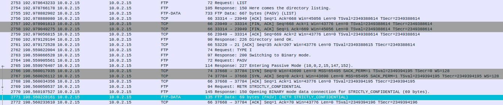
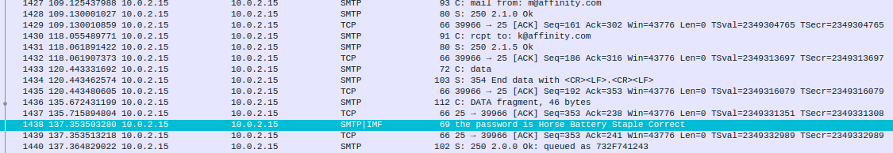

#### Challenge:

Note: put flag into AFFCTF{} format. [Man_In_The_Middle.pcap.gz](./Man_In_The_Middle.pcap.gz ":ignore")

---

#### Solution:

- confidential data can be found in FTP dir listing and later on can be captured binary see: 
- password can be found in SMTP `Horse Battery Staple Correct` see: 

```bash
file payload.bin # payload.bin: Vim encrypted file data
vim payload.bin
```

---

<details><summary>FLAG:</summary>

```
AFFCTF{I_Should_Have_Used_Safer_Connection_...}
```

</details>
