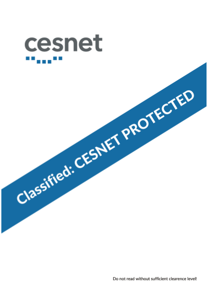

#### Challenge:

CESNET Forensic Laboratory need your help with the case ”Ethan’s Flash Drive”.

- Analyze the image of flash drive and check whether there are stored some classified documents.
- Classified documents you are looking for contain following first page: 
- One of the classified document contains information how to claim the contest prize.
- [catch-the-qubit_instructions.pdf](./catch-the-qubit_instructions.pdf ":ignore")
- [usb_image_stripped.tar.lzma](./usb_image_stripped.tar.lzma ":ignore")

---

#### Solution:

[Official write-up](https://flab.cesnet.cz/_media/cs/sluzby/catch-the-qubit_solution.pdf)

- inspect lyric files `lyrics_dear-john-letter.txt` that contains `decode the data, the password is, watch the video carefully, decode the veracrypt file`
- inspect files namely ones with `john` in name:
  -- `How to play Dear John Letter.mp4` - invalid mp3 file -> veracrypt
  -- `Dear John Letter (original).mp4` - inspect each frame

```bash
ffmpeg -i "./Dear John Letter (original).mp4" -vf fps=60 ./frames/frame-%d.png # manually inspect each frame
```

- `frame-4653.png` contains embeden string `TENSEC2018cesnet`
- mount veracrypt file with found password

```bash
git branch
git checkout transport
pdf-parser.py -o 666 ./form-air2018-027v3.pdf -d payload.bin
zlib-flate -uncompress < ./payload.bin  > payload.txt
cat ./payload.txt | perl -pe 's/([0-9a-f]{2})/chr hex $1/gie' | base64 -d  > payload-2.bin
file payload-2.bin
unzip -q ./payload-2.bin
```

---

<details><summary>FLAG:</summary>

```
https://goo.gl/gXBgx3
```

</details>
