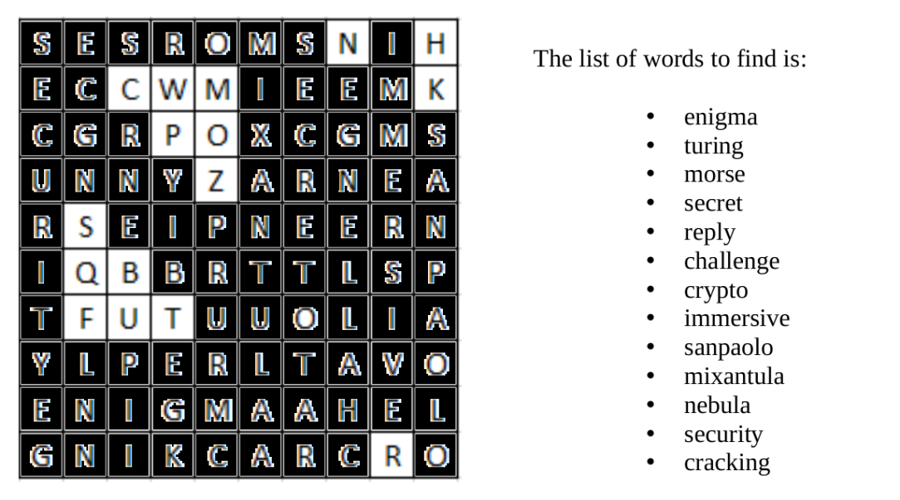

#### Challenge:

After the revelation of the Fourth Secret, all communications with the other Legends have stopped. Mixantula must rebuild the network of connections as quickly as possible. Without her protection, their locations are public and all of Codesia’s villains can discover their secrets. For this, she needs the help of exceptional hackers [crypto200-readme.pdf](./crypto200-readme.pdf ":ignore")

---

#### Solution:

The provided `PDF` describes that this will be WWII `Enigma` machine challenge. It contains the specific enigma type `M4 Shark`, a ciphertext and 2 obfuscated hints to the specific enigma settings. 

The first hint is a `morse code` string obfuscated by `ROT13` (`Caesar cipher`) hinting to enigma ring settings:

```
THE POSITIONS AND RINGS YOU NEED ARE F21 L18 T16 G11
```

The second hint is a crossword puzzle containing plugboard settings 

```
NH CW MK PO ZS QB FU TR
```

Unfortunately, I wasn't able to correctly utilize the first hint in any online / offline tools I tried, so I had to do a little brute-forcing of the rotors and reflectors parameters:

```python
from enigma.machine import EnigmaMachine 

reflectors = ['B','C','B-Thin','C-Thin']
rotors = ['I', 'II', 'III', 'IV', 'V', 'VI', 'VII', 'VIII', 'Beta', 'Gamma'] 

for r1 in rotors: 
    for r2 in rotors: 
        for r3 in rotors: 
            for r4 in rotors: 
                for r in reflectors: 
                    machine = EnigmaMachine.from_key_sheet( 
                        rotors=' '.join([r1, r2, r3, r4]), 
                        reflector=r, 
                        ring_settings='21 18 16 11', 
                        plugboard_settings='NH CW MK PO ZS QB FU TR'.upper()
                    ) 
                    
                    # set machine initial starting position
                    machine.set_display('fltg')
                    temp = machine.process_text('utogaaxgeonuvkegegddajktikdtvepnkolokj') 
                    if temp.startswith('FLG'):
                        print(temp)
```

---

<details><summary>FLAG:</summary>

```
{FLG:thematrixhasyoufollowthewhiterabbit}
```

</details>
