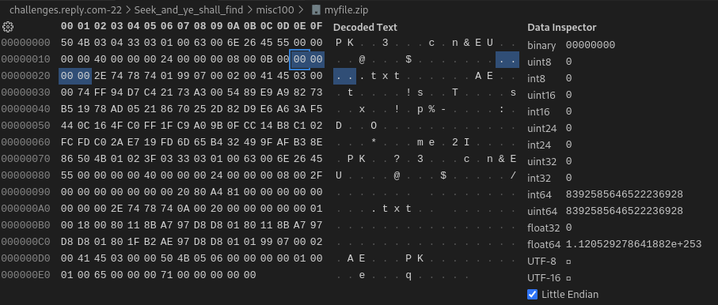

#### Challenge:

The planet of BC-12, where Zer0 is. After yet another jump, R-Boy finds a character named Bill in front of a huge sequence of gates. Bill tells R-Boy that each gate is made of a different material from other copies of the planet. Each gate has its own unique weakness. How will R-Boy get through them all?

`Password:s33k4ndy3sh4llf1nd!`

[misc100.zip](./misc100.zip ":ignore")

---

#### Solution:

Extracting the provided archive we get a file named `proof.img`.
Running `file proof.img` we see it is a `DOS/MBR partition`:

```text
proof.img: DOS/MBR boot sector, code offset 0x58+2, OEM-ID "MSDOS5.0", sectors/cluster 16, reserved sectors 3470, Media descriptor 0xf8, sectors/track 63, heads 255, sectors 30031872 (volumes > 32 MB), FAT (32 bit), sectors/FAT 14649, reserved 0x1, serial number 0x7cb8d6bc, unlabeled
```

Using `fls -l proof.img` utility from [sleuthkit](http://www.sleuthkit.org/), we see there are `3 PNG` files, `2 JPG` files and `1 ZIP` file that could be of interest:

```text
r/r * 4:        myfile.zip      2022-10-05 08:58:10 (CEST)      2022-10-05 00:00:00 (CEST)      0000-00-00 00:00:00 (UTC)       2022-10-05 14:48:44 (CEST)      236     0       0
d/d * 5:        _YSTEM~1        2022-10-05 16:42:48 (CEST)      2022-10-05 00:00:00 (CEST)      0000-00-00 00:00:00 (UTC)       2022-10-05 16:42:46 (CEST)      8192    0       0
d/d * 7:        .Trash-1000     2022-10-05 14:48:00 (CEST)      2022-10-05 00:00:00 (CEST)      0000-00-00 00:00:00 (UTC)       2022-10-05 14:48:00 (CEST)      8192    0       0
r/r * 9:        00033584.png    2022-10-05 14:49:00 (CEST)      2022-10-05 00:00:00 (CEST)      0000-00-00 00:00:00 (UTC)       2022-10-05 14:49:00 (CEST)      5175    0       0
r/r * 11:       00033600.png    2022-10-05 14:49:00 (CEST)      2022-10-05 00:00:00 (CEST)      0000-00-00 00:00:00 (UTC)       2022-10-05 14:49:00 (CEST)      1758    0       0
r/r * 13:       00033616.png    2022-10-05 14:49:00 (CEST)      2022-10-05 00:00:00 (CEST)      0000-00-00 00:00:00 (UTC)       2022-10-05 14:49:01 (CEST)      361911  0       0
r/r * 15:       00032848.jpg    2022-10-05 14:49:12 (CEST)      2022-10-05 00:00:00 (CEST)      0000-00-00 00:00:00 (UTC)       2022-10-05 14:49:13 (CEST)      198804  0       0
r/r * 17:       00033248.jpg    2022-10-05 14:49:12 (CEST)      2022-10-05 00:00:00 (CEST)      0000-00-00 00:00:00 (UTC)       2022-10-05 14:49:13 (CEST)      171883  0       0
d/d 20: System Volume Information       2022-10-05 16:51:50 (CEST)      2022-10-05 00:00:00 (CEST)      0000-00-00 00:00:00 (UTC)       2022-10-05 16:51:49 (CEST)      8192    0       0
r/r * 23:       .Trash-1000 - Shortcut.lnk      2022-10-05 16:52:08 (CEST)      2022-10-05 00:00:00 (CEST)      0000-00-00 00:00:00 (UTC)       2022-10-05 16:52:06 (CEST)      648     0       0
v/v 2675715:    $MBR    0000-00-00 00:00:00 (UTC)       0000-00-00 00:00:00 (UTC)       0000-00-00 00:00:00 (UTC)       0000-00-00 00:00:00 (UTC)       512     0       0
v/v 2675716:    $FAT1   0000-00-00 00:00:00 (UTC)       0000-00-00 00:00:00 (UTC)       0000-00-00 00:00:00 (UTC)       0000-00-00 00:00:00 (UTC)       7500288 0       0
v/v 2675717:    $FAT2   0000-00-00 00:00:00 (UTC)       0000-00-00 00:00:00 (UTC)       0000-00-00 00:00:00 (UTC)       0000-00-00 00:00:00 (UTC)       7500288 0       0
V/V 2675718:    $OrphanFiles    0000-00-00 00:00:00 (UTC)       0000-00-00 00:00:00 (UTC)       0000-00-00 00:00:00 (UTC)       0000-00-00 00:00:00 (UTC)       0       0       0
```
Lets extract them using `icat` based on their `inodes` from `fls` output:

```bash
icat proof.img 4 > myfile.zip
icat proof.img 9 > 33584.png
icat proof.img 11 > 33600.png
icat proof.img 13 > 33616.png
icat proof.img 15 > 32848.jpg
icat proof.img 17 > 33248.jpg
```

The image files don't point to anything but the `ZIP` file is interesting, according to `file` command it is encrypted:

```text
myfile.zip: Zip archive data, at least v5.1 to extract, compression method=AES Encrypted
```

But when I tried to decrypt it using the password provided in the challenge description I got various errors depending on the tool used.
Delving deeper into it, I opened the `ZIP` file in `HEX editor` and comparing it against [PK ZIP file structure](https://users.cs.jmu.edu/buchhofp/forensics/formats/pkzip.html), I noticed that `4 bytes` where the filename was supposed to be were changed to `NUL` bytes and only `.txt` remained:



After changing these 4 bytes to `"flag"` (`66 6c 61 67`), I was able to unzip the archive using the provided password and recover the flag:

```bash
7z x -p's33k4ndy3sh4llf1nd!' myfile.zip
```

---

<details><summary>FLAG:</summary>

```
{FLG:y0u_4r3_4_v3ry_g00d_pol1c3m4n}
```

</details>
