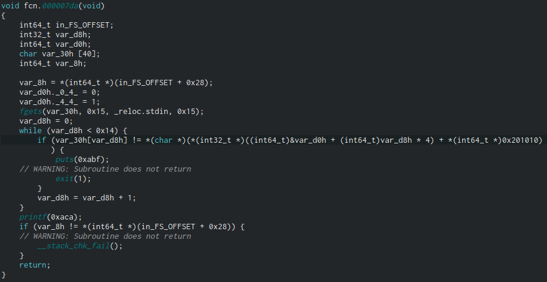

#### Challenge:

Decepticons are coming.

`nc pwn.byteband.it 6000`

---

#### Solution:

- after connecting server returns `base64` encoded [binary](./binary ":ignore") that needs to be reversed and secret is submitted then...
- this needs to be done 300 times

- in dissassembly we can see that it just compares bytes with user input from specific offsets



- all we need to do is extract values from `ro.data` for each recieved binary and reconstruct secret from it...

```python
from pwn import *
import struct
import os


def solve(secret, offsets, l):
    print(secret, offsets)
    msg = ""
    for i in range(l):
        msg += secret[offsets[i]]

    return msg


def decompile(file):
    offsets = []
    secret = ""
    elf = ELF(file)
    for l in elf.disasm(elf.entrypoint, 750).splitlines():
        if "DWORD PTR" in l and "mov" in l and "], 0x" in l:
            offsets.append(int(l.split("], ")[1], 16))
    for addr in elf.search(b'Wrong pass'):
        secret = elf.string(addr - 31).decode("utf-8")

    return solve(secret, offsets, offsets[:-1][-1:][0])


context.log_level = 'error'
r = remote('pwn.byteband.it', 6000)

while True:
    bin = r.recvline().strip().decode("utf-8")
    print(bin)
    if "wrong password, lol" in bin:
        break
    print("-----")
    os.system("echo -n '" + bin + "' | base64 -d > /tmp/binary")
    msg = decompile("/tmp/binary")
    print(msg)
    r.sendline(msg)
```

---

<details><summary>FLAG:</summary>

```
flag{0pt1mus_pr1m3_has_chosen_you}
```

</details>
<br/>
