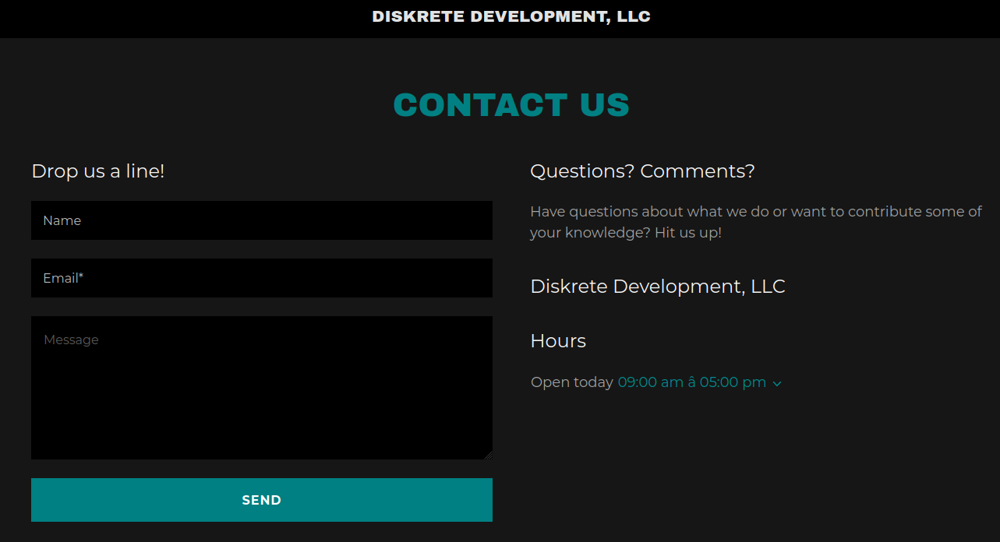

#### Challenge:

Veronica sent a message to her client via their website's Contact Us page. Can you find the message?  [ContactUs.pcap](./ContactUs.pcap ":ignore"), [sslkeyfile.txt](./sslkeyfile.txt ":ignore")

---

#### Solution:

- after decrypting the `ssl` traffic in provided `pcap`, we see what pages `Veronica` visited. One of them was `diskretedevelopment.com/contact-us.html` that contains `form`


- based on this, we try to look for `POST` requests for this form using filter `http2 && json`. That reveals the flag in one of the requests:

```json
{
    "websiteId": "19460325-6441-4243-8b04-b46ca980c66e",
    "widgetId": "8255c38e-a587-47a4-a20e-59be4641c0ee",
    "pageId": "63d86d88-7512-46e2-b820-3b9933274865",
    "accountId": "f0800d6f-02ed-11ec-8235-3417ebe72601",
    "domainName": "diskretedevelopment.com",
    "optedToSubscribe": false,
    "locale": "en-MY",
    "metadata": {
        "formIdentifier": "CONTACT_US",
        "pathName": "/contact-us",
        "deviceType": "desktop",
        "deviceOs": "Linux",
        "browserName": "Firefox"
    },
    "formData": [
        {
            "label": "Name",
            "value": "Veronica Mars",
            "keyName": "name"
        },
        {
            "label": "Email",
            "value": "vmarsinvestigations87@gmail.com",
            "replyTo": true,
            "keyName": "email"
        },
        {
            "label": "Message",
            "value": "flag{m@r$hm3ll0w$}",
            "keyName": "message"
        },
        {
            "label": "_app_id",
            "value": ""
        }
    ],
    "recaptchaToken": "03AGdBq27seuHr1NzCgH4LKc0PErd_Z8rvPuNireiinjHmuqONbkC0cXTVOQL5xWue1quL9xgshpN00ns1gH6o4eGpiUmc39gqUcqT-YCgdaDVB5Z7UwM8ZBMJWXXiE2dLDt9Qb4LBxWVnVAo64_oRr1f8vS6xNMK0MLqOI2h83SlvfqJkFiJUc1pGNkjzNYjYMVbMcJVcUr6tjuU5seSUhWm_UzxhuO24LJP9kJvzRzhW_sYh_zLF525GUCOvDFXm6KaxNdOPMFFReEgHx1yoQIdcZhSJmO_W-0CPCiGmZQuEkhoT4i3vtukqbkjHDxU7Id72HS387zsCAUL8dvVWopnua2q6xPVkJQhpkeUZ5K2OWMHpqfxRvgOPfwp6df5sb86SupPle4LCFV2RBZyGoe4TYnOHSJhq1zzytQTxo3NXsPuR7buo4UFwN2B2o_TVjZC6Juxac-DvcL2RgHuUq4kTAykC1gcimQ"
```

---

<details><summary>FLAG:</summary>

```
flag{m@r$hm3ll0w$}
```

</details>
<br/>
