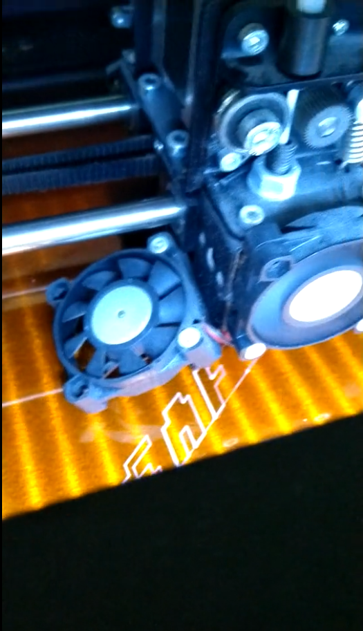
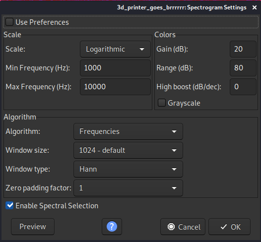
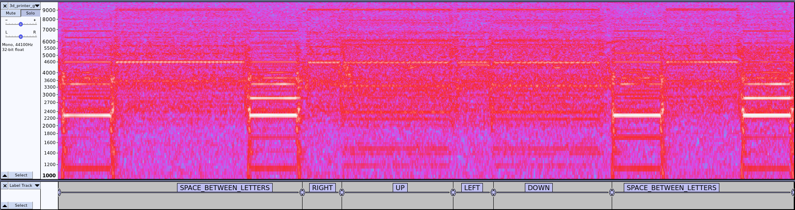

#### Challenge:

We have 3D printed a great object, and wanted to show you... unfortunately we only have the video file of the printing... and it's corrupted.
But they say when you have 3d printed enough, you don't even hear the sounds. All you hear is blonde, brunette, redhead.

---

#### Solution:

We are presented with a video of an 3D Printer that's printing the flag:



The problem is, that after first 30 seconds where we can see that the start of the flag - `SAF` - was printed, the video track freezes, and until the end of the recording only the sounds of the printer can be heard.

```bash
ffprobe 3d_printer_goes_brrrrrr.mkv
ffprobe version 4.2.2-1+b1 Copyright (c) 2007-2019 the FFmpeg developers
  built with gcc 9 (Debian 9.2.1-28)
  configuration: --prefix=/usr --extra-version=1+b1 --toolchain=hardened --libdir=/usr/lib/x86_64-linux-gnu --incdir=/usr/include/x86_64-linux-gnu --arch=amd64 --enable-gpl --disable-stripping --enable-avresample --disable-filter=resample --enable-avisynth --enable-gnutls --enable-ladspa --enable-libaom --enable-libass --enable-libbluray --enable-libbs2b --enable-libcaca --enable-libcdio --enable-libcodec2 --enable-libflite --enable-libfontconfig --enable-libfreetype --enable-libfribidi --enable-libgme --enable-libgsm --enable-libjack --enable-libmp3lame --enable-libmysofa --enable-libopenjpeg --enable-libopenmpt --enable-libopus --enable-libpulse --enable-librsvg --enable-librubberband --enable-libshine --enable-libsnappy --enable-libsoxr --enable-libspeex --enable-libssh --enable-libtheora --enable-libtwolame --enable-libvidstab --enable-libvorbis --enable-libvpx --enable-libwavpack --enable-libwebp --enable-libx265 --enable-libxml2 --enable-libxvid --enable-libzmq --enable-libzvbi --enable-lv2 --enable-omx --enable-openal --enable-opencl --enable-opengl --enable-sdl2 --enable-libdc1394 --enable-libdrm --enable-libiec61883 --enable-chromaprint --enable-frei0r --enable-libx264 --enable-shared
  libavutil      56. 31.100 / 56. 31.100
  libavcodec     58. 54.100 / 58. 54.100
  libavformat    58. 29.100 / 58. 29.100
  libavdevice    58.  8.100 / 58.  8.100
  libavfilter     7. 57.100 /  7. 57.100
  libavresample   4.  0.  0 /  4.  0.  0
  libswscale      5.  5.100 /  5.  5.100
  libswresample   3.  5.100 /  3.  5.100
  libpostproc    55.  5.100 / 55.  5.100
Input #0, matroska,webm, from '3d_printer_goes_brrrrrr.mkv':
  Metadata:
    title           : The 3d printer
    ARTIST          : SpamAndHex
    ENCODER         : Lavf58.29.100
  Duration: 00:01:35.43, start: 0.000000, bitrate: 821 kb/s
    Stream #0:0(eng): Video: h264 (High), yuvj420p(pc, progressive), 540x960 [SAR 1:1 DAR 9:16], 29.50 fps, 29.50 tbr, 1k tbn, 59 tbc (default)
    Metadata:
      ENCODER         : Lavc58.54.100 libx264
      HANDLER_NAME    : VideoHandle
      DURATION        : 00:00:30.000000000
    Stream #0:1: Audio: flac, 44100 Hz, mono, s16
    Metadata:
      DURATION        : 00:01:35.434000000
```

Running `ffprobe` reveals that the video track has in fact only 30 seconds, but we are given audiotrack with great quality that has full lenght (1:35) of the video, from which we are supposed to guesstimate the content of the flag (also based on [The Matrix hint](https://www.youtube.com/watch?v=3vAnuBtyEYE) from the challenge description.)

So, we exported the audio track to open it in `audacity`:

```bash
ffmpeg -i 3d_printer_goes_brrrrrr.mkv -vn -acodec copy output-audio.flac
```

We opened the exported audio track in `audacity` and displayed its spectrogram. After long and painful tuning, we used following settings for the spectrogram:



From the first 30 seconds of the video as well as from the spectrogram of the audio track displayed by audacity, we inferred following pieces of info:

- The outline of font used for the flag contains `only horizontal and vertical lines`, no diagonals. These produce lines in the spectrogram which, helps us to determine lengths and quantities of the lines used for the letters. Only problem is to estimate the direction (e.g. if the horizontal line goes from left to right or from right to left).
- The letters are always printed in `counter-clockwise direction`
- The starting point of every letter is always `the bottom left corner` and `starting point is also the ending point`.
- The vertical and horizontal lines `strictly alternate` (e.g there are never two consecutive horizontal lines).
- The letters `always start with horizontal line going right` and `end with vertical line going down`.
- Since the `a` in the `SAF` was `capital` in the video track, we can assume that `all the letters are capitals`.
- The `letters are divided` by spaces defined by `elevation of the nozzle, horizontal move and lowering of the nozzle`, which produces two high-pitch sounds divided by one sound with lower pitch. These sounds are very distinguishable in the audio, as well as in the histogram.
This helps us to determine the beginnings and endings of the letters.
It also gives us the information, that `there are 15 letters` in the flag, including the `SAF` that we saw in the video and the curly braces `{}`, that we assumed from the flag format for the competition.
- Since the starting point equals the ending point, the sum of lengths of horizontal lines with `RIGHT` direction in one letter must equal to the sum of lengths of horizontal lines with the `LEFT` direction for the same letter. Similar rule goes for the vertical lines.

For the illustration, let's examine the simplest letter `capital i`.
In the beginning and in the end of the image we can see the inter-letter space as described above, and between that there are 4 recognizable regions (short, long, short, long) and we can tell by looking at frequencies under 2000 Hz that the short regions are similar to each other and also to the horizontal movement in the inter-letter space, so we can assume that the short regions are horizontal lines. The long regions are also similar to each other, but they are different than the horizontal lines, so we can assume they are the vertical lines. Since we need to end, where we started, it's trivial to guess that these four lines form simple rectangle, and applying above mentioned pieces of information, we can label them with directions `RIGHT`, `UP`, `LEFT` and `DOWN`.



While working on this, I was trying to find some markers in the spectrogram, that would help me unambiguously determine the direction of the lines, so I could solve this challenge deterministically and programmatically, but in the end I wasn't able to find such thing. While pondering about this, my girlfriend (let's call her `biohacker` for the sake of this writeup) offered to me, that she will try to guess the letters manually, by applying above mentioned rules and drawing possibilities on the checked paper. After approximately 3 hours, she was able to manually guesstimate the directions of the lines and from that infer the missing letters of the flag, so kudos to my GF - `biohacker`!

Note: for reference I enclose [3D-printer-task.tar.lzma](./3D-printer-task.tar.lzma ":ignore"), which contains the audacity project with manually labeled recording.

---

<details><summary>FLAG:</summary>

```
SAF{AIRGAPPED2}
```

</details>
<br/>
