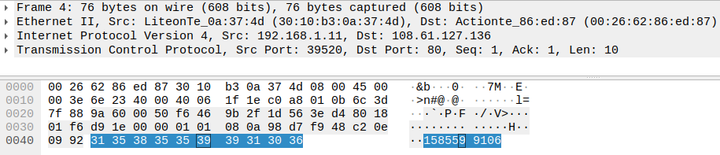

#### Challenge:

Please help! An evil script-kiddie (seriously, this is some bad code) was able to get this ransomware "NotWannasigh" onto one of our computers. The program ran and encrypted our file "flag.gif".

These are the resources we were able to gather for you:

- NotWannasigh.zip - the malicious ransomware executable
- flag-gif.EnCiPhErEd - our poor encrypted file that we need you to recover
- ransomNote.txt - the note left behind by the ransomware. I'm not sure you'll find anything usefull here
- 192-168-1-11_potential-malware.pcap - a packet capture that our IDS isolated, it seems that the program has some weird form of data exfiltration

We need you to reverse the malware and recover our flag.gif file. Good luck!

A note from the creator: Shoutout to Demonslay335 for challenge inspiration - he's done some awesome work in fighting ransomware. Also, the ransomware in this challenge is programmed to only target files named "flag.gif" so you shouldn't need to worry about the accidental execution, I just zipped it out of habit/good practice. Have fun and happy hacking!

[192-168-1-11_potential-malware.pcap](./192-168-1-11_potential-malware.pcap ":ignore") [ransomNote.txt](./ransomNote.txt ":ignore") [flag-gif.EnCiPhErEd](./flag-gif.EnCiPhErEd ":ignore") [NotWannasigh.zip](./NotWannasigh.zip ":ignore")

---

#### Solution:

- decompilation of binary reveals 2 important parts:
  - seed of `srand()` is based on `time()` and send to remote server
    
  - encryption is just XOR of `rand()`
    
  - from included PCAP seed of `srand()` can be retrieved
    

```c
#include <stdio.h>
#include <stdint.h>
#include <stdlib.h>

int main(void)
{
    int i;
    char c, cc;
    FILE *flag_fp_in;
    unsigned long flag_size;
    FILE *flag_fp_out;

    srand(1585599106); // seed from pcap
    flag_fp_in = fopen("flag-gif.EnCiPhErEd", "r+");
    flag_fp_out = fopen("flag.gif", "w+");
    fseek(flag_fp_in, 0, 2);
    flag_size = ftell(flag_fp_in);
    fseek(flag_fp_in, 0, 0);
    i = 0;
    while (1)
    {
        c = fgetc(flag_fp_in);

        if (flag_size <= i)
            break;

        cc = (char)rand() ^ (char)c;
        fputc(cc, flag_fp_out);
        i = i + 1;
    }
    fclose(flag_fp_in);
    fclose(flag_fp_out);

    return 0;
}
```

---

<details><summary>FLAG:</summary>

```
WPI{It_always_feels_a_little_weird_writing_malware}
```

</details>
<br/>
