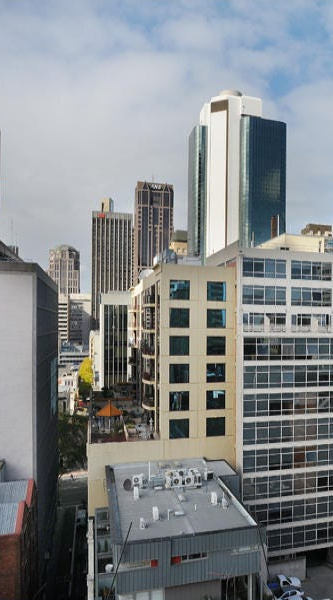

#### Challenge:

We received intel that the accomplice we have been following is meeting with the ringleader of RaaS operation, they shared this photo online a few years back - believed to be the view from their apartment building (hideout).

Between you and me, our sources say the ringleader was testing the ransomware they were going to sell and instead infected their own laptop.

We think we may be able to setup a sting to apprehend the ringleader and retrieve the decryption key when they meet the accomplice at a dead drop in a nearby alleyway. Can you work out what the name of the street is?

Flag format: `DUCTF{street_name}`



---

#### Solution:

Googling for `australia skyscrapers` turns up [this image](https://www.alamy.com/the-panoramic-view-of-melbourne-downtown-skyscrapers-victoria-australia-image224295034.html) with the same buildings from different angle in Melbourne. After that, it is "only" the (tedious) matter of `google street view` to get the viewpoint right.

---

<details><summary>FLAG:</summary>

```
DUCTF{McLean_Alley}
```

</details>
<br/>
