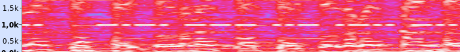

#### Challenge:

Do the loop doop doop...

Flag format: The STRING you end up with after solving challenge, case insensitive. [monorail.wav](./monorail.wav ":ignore")

---

#### Solution:

- audio recording contains `morse` code mixed with song, under the spectrogram we can see it around 1k



- decoding it reveals flag `.. -.-. --- ..- .-.. -.. .-.. .. ... - . -. - --- - .... .. ... --- -. .-.. --- --- .--. .- .-.. .-.. -.. .- -.--` [CyberChef](https://gchq.github.io/CyberChef/#recipe=From_Morse_Code('Space','Line%20feed')&input=Li4gLS4tLiAtLS0gLi4tIC4tLi4gLS4uIC4tLi4gLi4gLi4uIC0gLiAtLiAtIC0tLSAtIC4uLi4gLi4gLi4uIC0tLSAtLiAuLS4uIC0tLSAtLS0gLi0tLiAuLSAuLS4uIC4tLi4gLS4uIC4tIC0uLS0)

---

<details><summary>FLAG:</summary>

```
ICOULDLISTENTOTHISONLOOPALLDAY
```

</details>
<br/>
