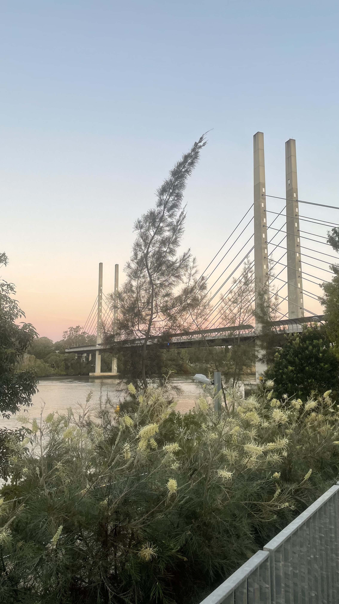

#### Challenge:

Bridget loves bridges, this one is her favourite.

What is the name of it and the length of its main span to the nearest metre?

Flag format:  `DUCTF{the_bridge_name-1337m}`



---

#### Solution:

Googling the image throuh image search with keyword `Australia` revealed similar picture. After that I checked the [wikipedia](https://en.wikipedia.org/wiki/Eleanor_Schonell_Bridge) for the length (390m) but It didnt work.
Found out on discord server later that the length required was deck lenght not the total.
---

<details><summary>FLAG:</summary>

```
DUCTF{eleanor_schonell_bridge-185m}
```

</details>
<br/>
