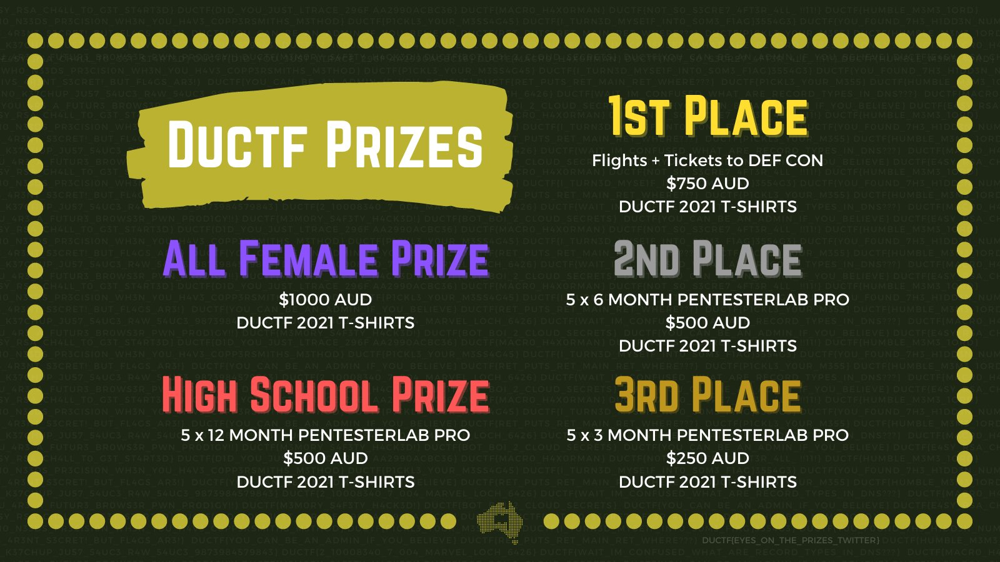

#### Challenge:

If you have been paying attention to our Twitter, we have been using flags in the background of our graphics this year. However, one of these flags stands out a bit more than the rest! Can you find it?

While you're there, why don't you give us a follow to keep up to date with DownUnderCTF!

---

#### Solution:

- going through `DUCTF` twitter posts reveals flag in one the posts



---

<details><summary>FLAG:</summary>

```
DUCTF{EYES_ON_THE_PRIZES_TWITTER}
```

</details>
<br/>
