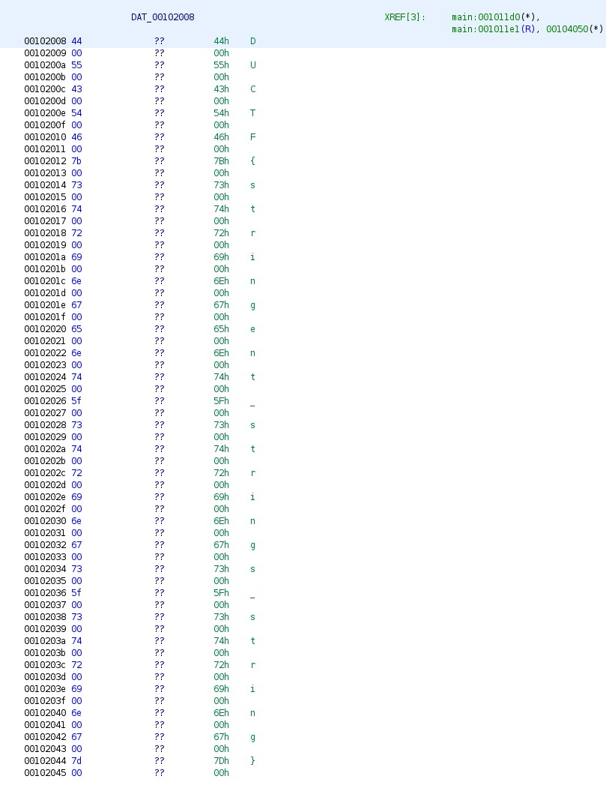

#### Challenge:

This binary contains a free flag. No strings attached, seriously! [nostrings](./nostrings ":ignore")

---

#### Solution:

After playing aroud in `Ghydra` with this file, I noticed that in main function it refers to `flag` which is pointer to the `DATA` section of the program. There the flag was saved as one letter strings:


---

<details><summary>FLAG:</summary>

```
DUCTF{stringent_strings_string}
```

</details>
<br/>
