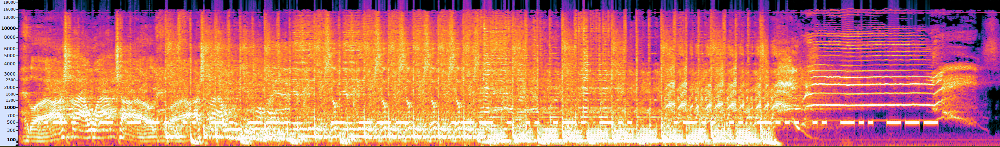

#### Challenge:

A raging Real Wild Child!

Flag is the STRING you end up with after solving challenge, case insensitive.

[rage.wav](./rage.wav ":ignore")

---

#### Solution:

Opening the provided `WAV` file in `audacity` and checking out the `spectrogram` shows:



Noticing `dots` and `lines` at 500 Hz:

```text
.-. .- --. .. -. --. - --- .-- . .. .-. -.. .-.. .. -... .. -.. ---
```

 I put them into [CyberChefs Morse code decoder](https://gchq.github.io/CyberChef/#recipe=From_Morse_Code('Space','Line%20feed')&input=Li0uIC4tIC0tLiAuLiAtLiAtLS4gLSAtLS0gLi0tIC4gLi4gLi0uIC0uLiAuLS4uIC4uIC0uLi4gLi4gLS4uIC0tLQ) and got the flag.

---

<details><summary>FLAG:</summary>

```
RAGINGTOWEIRDLIBIDO
```

</details>
<br/>
