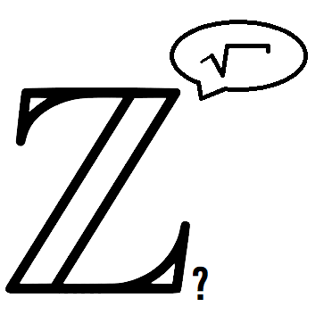

#### Challenge:

```
1111111111111111111111111111111111111111111111111111111111111111111111111111111111:1001001:10010:1010011:234:151:234:1100010:1221:115:47:311:74:6D:57:1100101:5A:310:2E:100:27:4B:45:300:340:2G:11100:72:1M:3P:41
```



---

#### Solution:

```python
#!/usr/bin/python3

import math

numbers = "1111111111111111111111111111111111111111111111111111111111111111111111111111111111:1001001:10010:1010011:234:151:234:1100010:1221:115:47:311:74:6D:57:1100101:5A:310:2E:100:27:4B:45:300:340:2G:11100:72:1M:3P:41"


def decode_base(b, v):
    if (b == 1):
        return chr(v.strip().count('1'))
    else:
        return chr(int(str(int(v.strip(), b)), 10))


index = 1
character = ''
for n in numbers.split(':'):
    if index == 1:
        character = decode_base(1, n)
    elif index == 4 or index == 8 or index == 16:
        character = decode_base(2, n)
    elif index == 9:
        character = decode_base(3, n)
    elif index == 18:
        character = decode_base(6, n)
    elif index == 20:
        character = decode_base(10, n)
    elif index == 24:
        character = decode_base(6, n)
    elif index == 25:
        character = decode_base(5, n)
    elif index == 27:
        character = decode_base(3, n)
    elif index == 28:
        character = decode_base(14, n)
    else:
        character = decode_base(index, n)
    print(character, end="")
    index += 1

```

---

<details><summary>FLAG:</summary>

```
RITSEC{b4s3ƽ_aRe_r4d1cal_Dud3s}
```

</details>
<br/>
