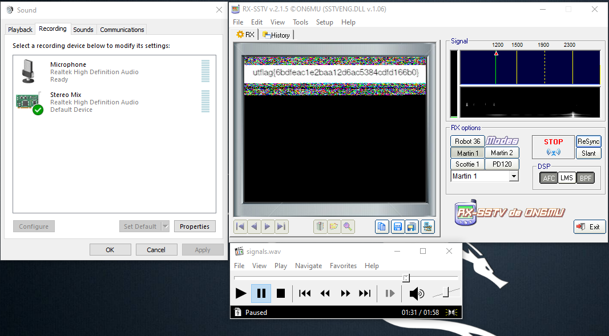

#### Challenge:

I recently received this signal transmission known as SSTV in a mode called Martian? This technology is all very old so I'm not sure what to do with it. Could you help me out? [signals.wav.tar.lzma](./signals.wav.tar.lzma ":ignore")

---

#### Solution:

Simply decoding the provided `wav` in the `Martian mode` using software [RX-SSTV](http://users.belgacom.net/hamradio/rxsstv.htm) on Windows reveals the flag. 

The program is listening to default audio input, so in order to decode the `wav`, it is needed to forward the playback device to `Stereo Mix` recording device, which has to be marked as `default`.
After this setup, simply play the `wav` file in any player and the `RX-SSTV` will decode it.

Note: that the actual flag data are located in the recording from `1:16` to `1:26`.




---

<details><summary>FLAG:</summary>

```
utflag{6bdfeac1e2baa12d6ac5384cdfd166b0}
```

</details>
<br/>
