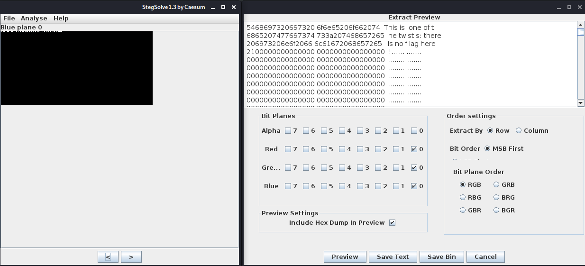

#### Challenge:

A simple image with a couple of twists... [Griffith_Observatory.png](./Griffith_Observatory.png ":ignore")

---

#### Solution:

Opening the image in `stegsolve` and checking the planes, we see that there is probably some info encoded in the `0th` bit plane of every color.
Unfortunately decoding it leads to [Red herring](https://en.wikipedia.org/wiki/Red_herring):



After this, we noticed that the file is too big for such small picture, which lead us to use `binwalk`. Running extracted binary revealed the flag.

```bash
binwalk -Me Griffith_Observatory.png
./_Griffith_Observatory.png.extracted/hidden_binary
```

---

<details><summary>FLAG:</summary>

```
utflag{2fbe9adc2ad89c71da48cabe90a121c0}
```

</details>
<br/>
