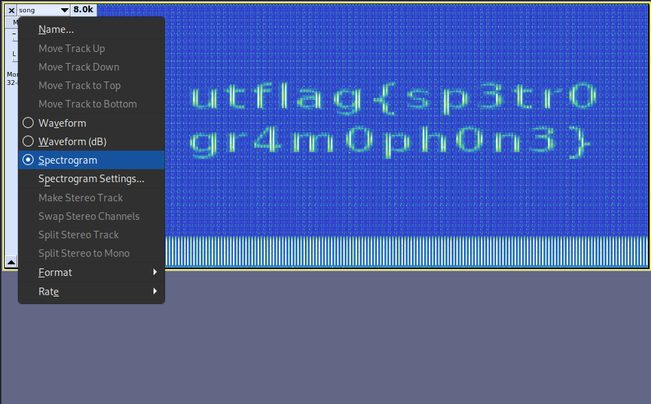

#### Challenge:

I found this audio file, but I don't think it's any song I've ever heard... Maybe there's something else inside? [song.wav](./song.wav ":ignore")

---

#### Solution:

The name of the challenge hints to `spectrogram` and simple display of spectrogram (e.g. in `audacity`) reveals the flag.



---

<details><summary>FLAG:</summary>

```
utflag{sp3tr0gr4m0ph0n3}
```

</details>
<br/>
