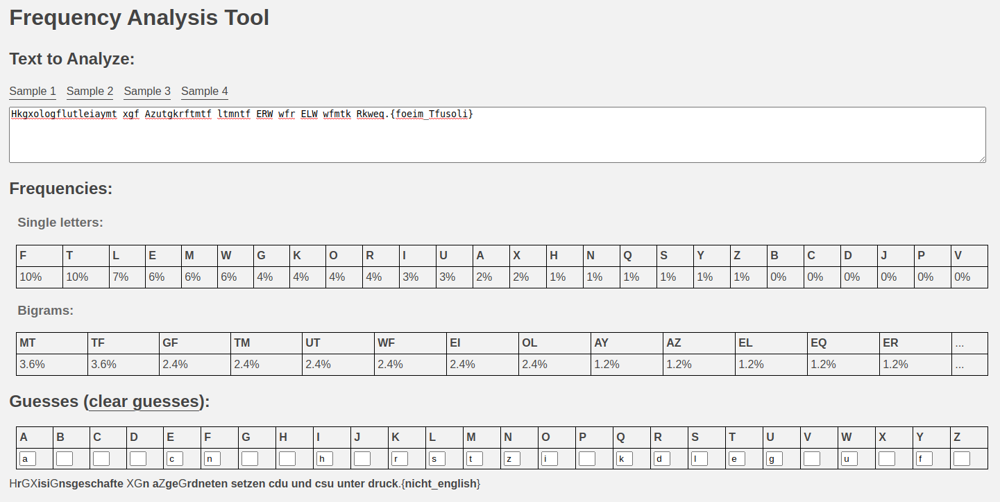

#### Challenge:

This flag was intercepted.
`wmysau{foeim_Tfusoli}`
<br><br>
Unfortunately, it seems to be encrypted. Additional encrypted text was also found.
<br>
`Hkgxologflutleiaymt xgf Azutgkrftmtf ltmntf ERW wfr ELW wfmtk Rkweq.`

---

#### Solution:

- via entropy analysis we can see that its `Luxembourgish` [CyberChef](https://gchq.github.io/CyberChef/#recipe=Magic(3,false,true,'')&input=SGtneG9sb2dmbHV0bGVpYXltdCB4Z2YgQXp1dGdrcmZ0bXRmIGx0bW50ZiBFUlcgd2ZyIEVMVyB3Zm10ayBSa3dlcS4)
- the `Luxembourgish` letter frequency needed for decryption is `enrastiudolhmgcfbpvkéwzë1ä09j285y7346xqüè ’ö“–ô„àç°êâáî²óаíαоиßенрοвкс”тл†ςνãû‎εïιβρ…μ×γ′δúλдмاñτηκь` [simia.net](http://simia.net/letters/), with this and little bit of patience we can guest some of the words and decode the flag




---

<details><summary>FLAG:</summary>

```
utflag{nicht_English}
```

</details>
<br/>
