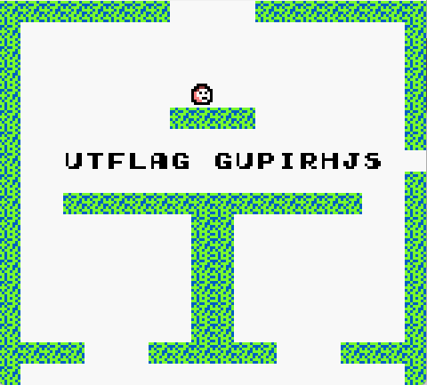

#### Challenge:

NOTE: The binary has been patched as of T+4.5H since CTF start. You should now be able to see a "YOU LOSE" message after reaching the bottom of the game.

I found this mysterious cartridge at the Nintendo headquarters, I think it might be some sort of prototype, can you find out how to beat the game?

Note: The flag appears in non-standard notation, in the form "UTFLAG ABCDEFGH"

By ggu [game.gb](./game.gb ":ignore")

---

#### Solution:

- playing the game via [vba-m](https://vba-m.com/) reveals that we need to just into holes 10 times in specific pattern
- observing the `memory` as we play reveals that `hole` resides on `C1C0` address and the actual XOR `key` resides at `C1BF`
- from this point we could just create cheat that will alter these memory regions and just jump to one of the holes to test if we got it right... after some time we got the final cheat values:
  - `C1BF` -> `56`
  - `C1C0` -> `09`
  - jump to left hole



---

<details><summary>FLAG:</summary>

```
UTFLAG GUPIRHJS
```

</details>
<br/>
