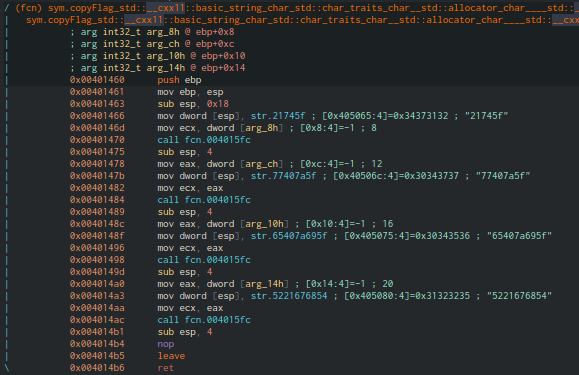

#### Challenge:

An easy reverse challenge. [a.exe](./a.exe ":ignore")

Hint: Follow the basics and the flag is yours.

** This challenge does not follow the flag format.**

---

#### Solution:

- inspect via [Cutter](https://github.com/radareorg/cutter) function `sym.copyFlag`



- merge hex strings and decode [CyberChef](<https://gchq.github.io/CyberChef/#input=MjE3NDVmNzc0MDdhNWY2NTQwN2E2OTVmNTIyMTY3Njg1NAo&recipe=From_Hex()>)

---

<details><summary>FLAG:</summary>

```
!t_w@z_e@zi_R!ghT
```

</details>
<br/>
