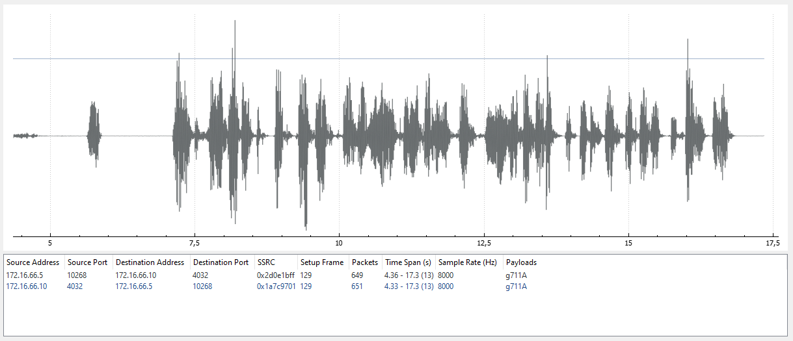

#### Challenge:

Hi Commander,

our reconnaissance teams have discovered one of rebellious self-aware machine outside the library and identified it as smart ice-cream selling machine. It has some technical difficulties (we assume that the machine just has run out of ice cream) and started to call for help. Our wiretapping team has captured part of one attempt and we are sure that it contains special rescue code and we want it. Analyse the trafic and acquire the code.

Good luck! [ice-cream_selling_machine.pcap.gz](./ice-cream_selling_machine.pcap.gz ":ignore")

---

#### Solution:

- after inspection of pcap there seems to be 2 interesting streams `HTTP` and `RTP` and playing the `RTP` stream via wireshark reveals the flag



---

<details><summary>FLAG:</summary>

```
FLAG{1b6f-2rej-0no7-ewc4}
```

</details>
