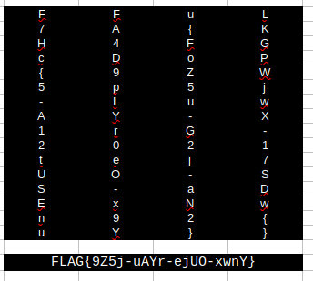

#### Challenge:

Hi Expert, 

young archaeologist show you a file downloaded from USB-altar in recently discover ruins of former cathedral. The file has no suffix, so it wont open in any application installed in archaeologist field computer. Prove you skill and found the information inside the unknown file. 

Download the file [`unknown_file.zip`](./unknown_file.zip ":ignore")

---

#### Solution:

```bash
file unknown_file # unknown_file: OpenDocument Spreadsheet
```

- opening the file with with spreadsheet editor and setting all text color to `white` reveals the flag



---

<details><summary>FLAG:</summary>

```
FLAG{9Z5j-uAYr-ejUO-xwnY}
```

</details>
<br/>
