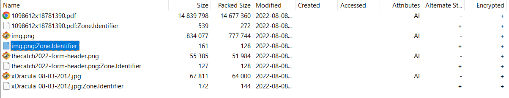

#### Challenge:

Hi, packet inspector,

our former employee Brenda (head of PR department) was working on new webpage with superdiscount code for VIP customers, but she get fired by AI because of "disturbing lack of machine precision".

Your task is to find the code as soon as possible. The only hope is an automated backup of Brenda's `Download` directory (there is a high probability that she had downloaded the discount page or part of it).

Download [the backup file](./download_backup.zip ":ignore") (MD5 checksum `2fd749e99a0237f506a0eb3e81633ad7`).

May the Packet be with you!

---

#### Solution:

We are given `ZIP` archive in which is `RAR` archive containing 4 files. There seems to be nothing leading to flag in those 4 files. After some time, I tried running `binwalk` on the `RAR` file itself, because it was weird to me, that those 4 files were zipped and then rar-ed when all other challenges had their files only zipped. It returned this:

```text
DECIMAL       HEXADECIMAL     DESCRIPTION
--------------------------------------------------------------------------------
0             0x0             RAR archive data, version 5.x
11604224      0xB11100        VMware4 disk image
```

Quick google search on `VMware` in context with `RAR` led me to this [site](https://www.howtogeek.com/734974/how-to-extract-files-from-a-vmware-disk-image-on-windows-for-free/).
Rebooting to Win and opening the archive with `7-Zip` revealed 4 new files that I was not able to see in linux:



One of them (`img.png:Zone.Identifier`) had following content:

```ini
[ZoneTransfer]
ZoneId=3
ReferrerUrl=http://self-service.mysterious-delivery.thecatch.cz/
HostUrl=http://self-service.mysterious-delivery.thecatch.cz/img.png
```

Fetching the content of the `URL` reveals the flag:

```bash
curl -sS http://self-service.mysterious-delivery.thecatch.cz/ | grep -oe "FLAG{.*}"
```

```bash
FLAG{16bd-0c4x-ZRJe-8HC3}
```

---

<details><summary>FLAG:</summary>

```
FLAG{16bd-0c4x-ZRJe-8HC3}
```

</details>
<br/>
