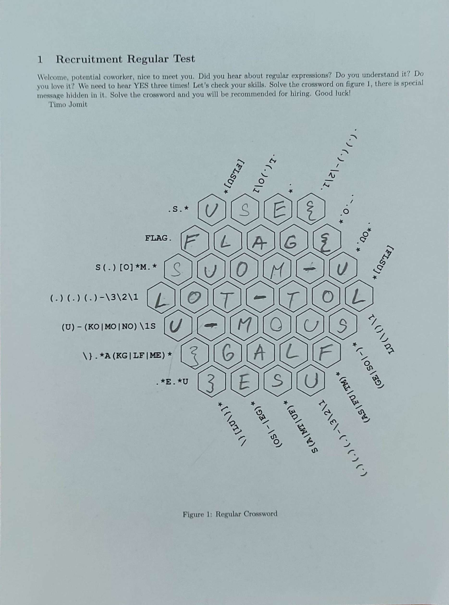

#### Challenge:

Hi, promising candidate,

you have to prove the knowledge of regular expressions. Our Finnish recruiter Timo has prepared some crossword suitable for this purpose.

Download [task description](./regex_crosword.zip ":ignore") (MD5 checksum `6448c1748cc6047470a5f00c3945c1c4`).

May the Packet be with you!

---

#### Solution:

We are given `ZIP` with PDF containing regex crossword puzzle. Simply solving it gets us the FLAG:



---

<details><summary>FLAG:</summary>

```
FLAG{SUOM-ULOT-TOLU-MOUS}
```

</details>
<br/>
